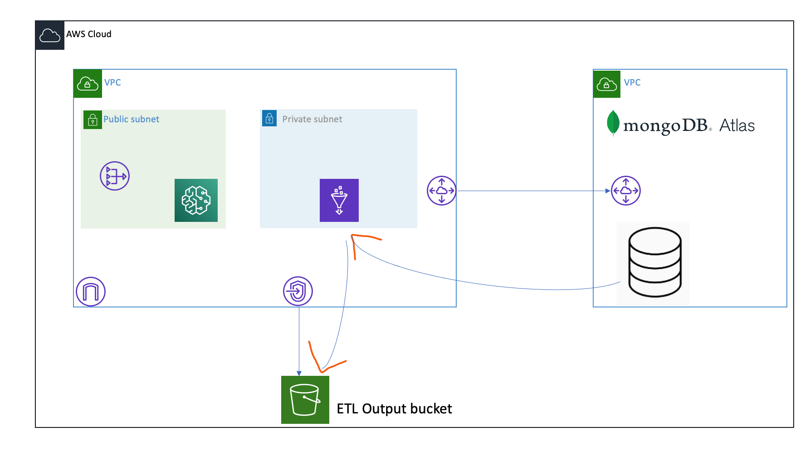
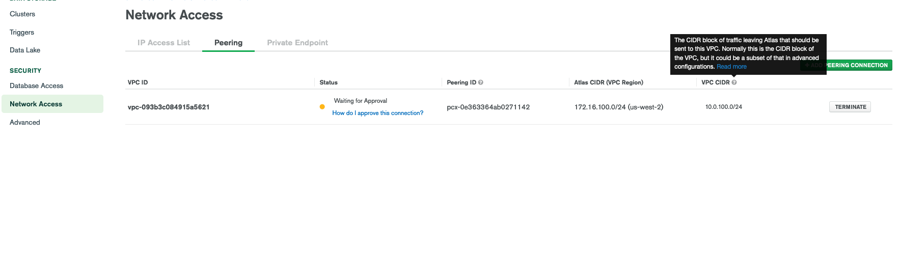
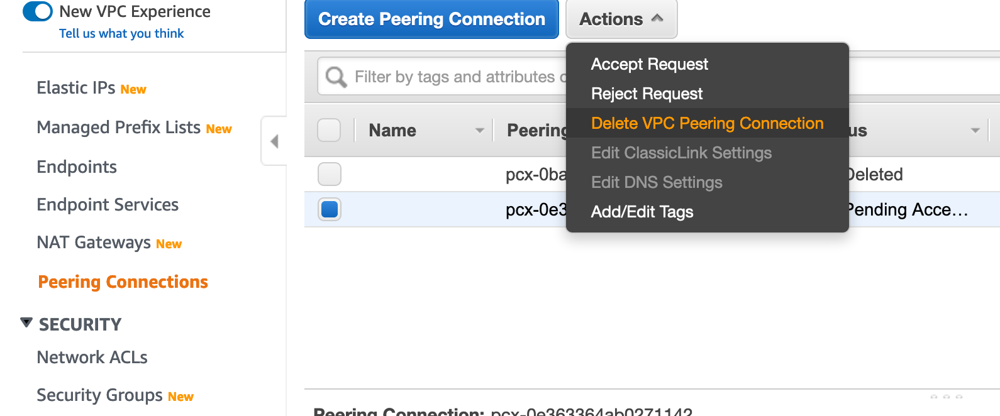
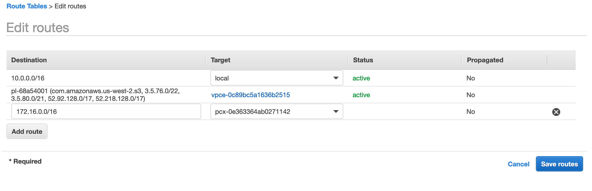
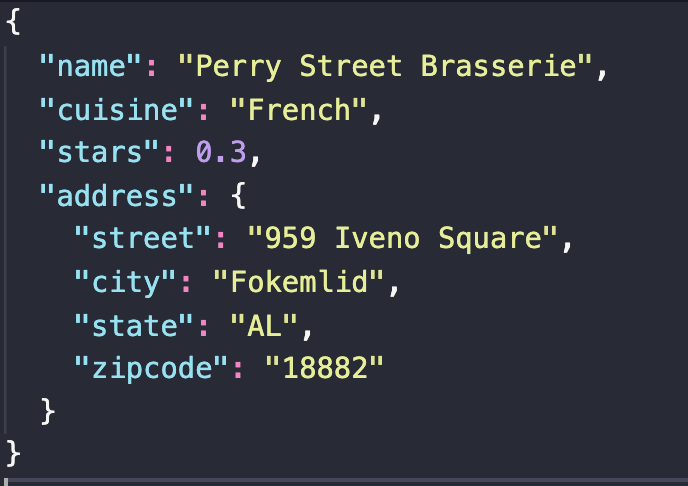
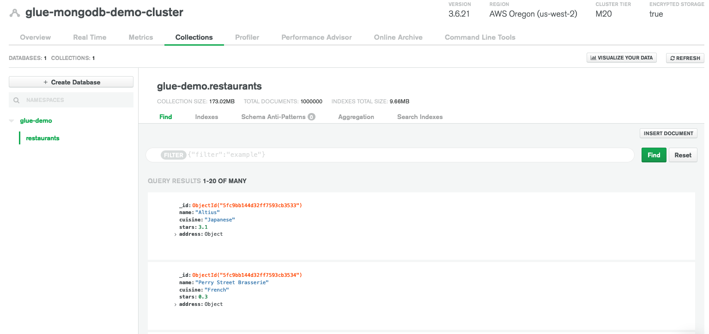
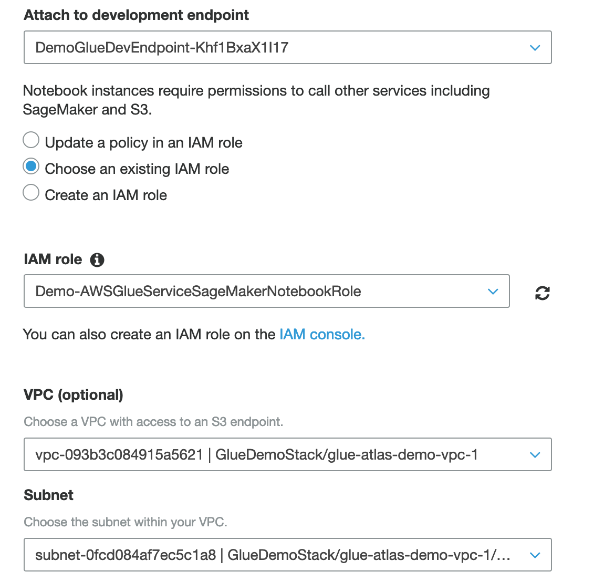
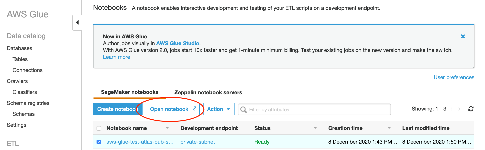
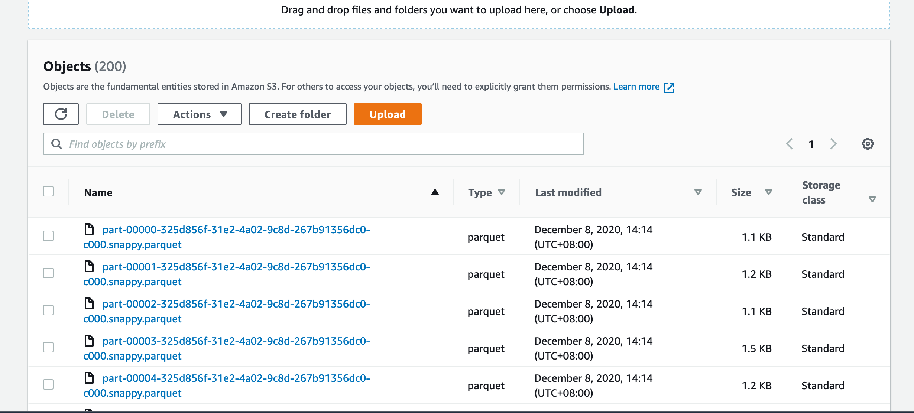
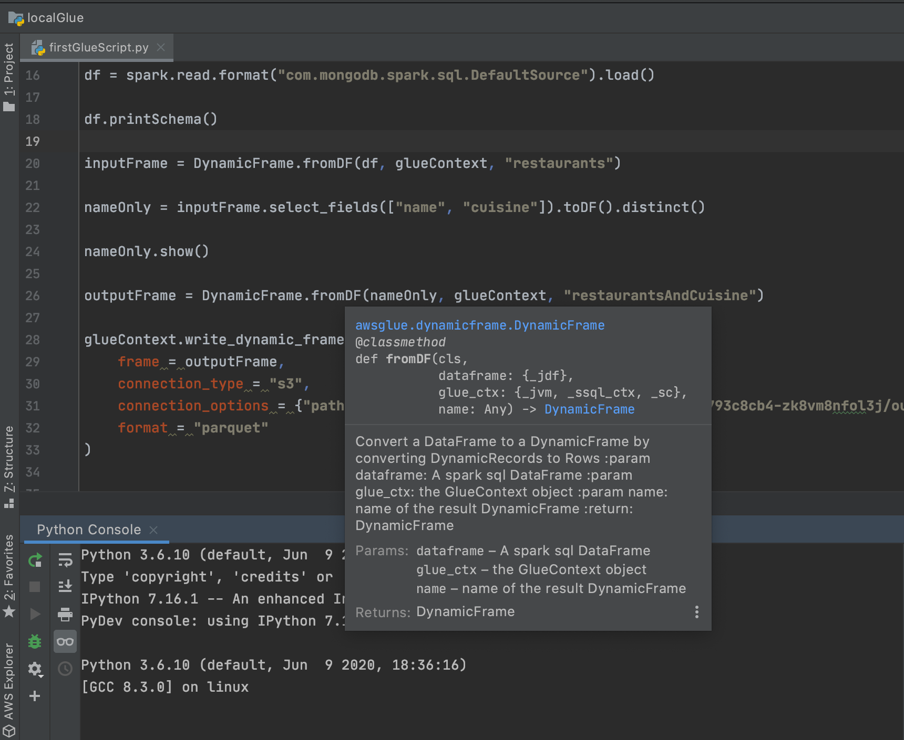

# Connect to MongoDB Atlas with AWS Glue

This repository shows you how to do ETL jobs with Glue using data in MongoDB Atlas, I cannot find a tutorial online about this so I decided to show you how to do that. Here we will extract raw data from Atlas, do some filtering and load it into S3 bucket in Parquet format which is compressed and optimized for querying with [AWS Athena](https://dev.to/server_not_found)

## Setup
We will set up a VPC in AWS and a MongoDB Atlas cluster with VPC peering to our VPC, so we can have a granular control on security.

Here is what we will setup: 

### Setup the AWS environment

I have prepared an [CDK](https://docs.aws.amazon.com/cdk/latest/guide/home.html) application so you will have a VPC, an S3 bucket. If you prefer to do that in the console, you can do that too. 

#### Deploy the stacks
1. `cd deployment/aws` Go to the directory with the stacks
2. `cdk synth GlueDemoStack` Generates CloudFormation template
3. `cdk deploy GlueDemoStack` Deploy the stacks into your account

### Setup MongoDB Atlas
Inside the directory `deployment/atlas` is Terraform templates for deploying a MongoDB Atlas project and cluster with VPC Peering enabled. You can also deploy the same environment using the Atlas Console. If you wonder how to setup API key for Terraform, refer to [here](https://docs.atlas.mongodb.com/tutorial/manage-programmatic-access/), and [this tutorial on creating Atlas cluster with VPC Peering](https://www.youtube.com/watch?v=PBa2uj4TG4I)

> You may say we can use Terraform to deploy everything including our AWS resources, but I think CDK offers a better way for doing that, you don't have to define every single resource you need like you would in 200+ lines of Terraform code

#### Deploy the template
1. `cd ../atlas` Go to the directory with the template
2. In file `atlas.tfvars`, change the variables to match your environment
3. You can also change the parameters in `main.tf` to fit your need
4. `terraform plan -var-file atlas.tfvars -out .tfstate`
5. `terraform apply ".tfstate"`

Once the deployment is completed if you go to your Atlas Console > Network Access you should see a peering request is pending for approval

Now go to your AWS VPC Console and accept the peering request

Then proceed to add a corresponding route table entry in the private subnet:

## Import dataset into MongoDB Atlas
Here we have a dataset which has a bunch of restaurants, if you wonder what is the schema, here it is:

1. Go to the directory containing the dataset
    `cd ../../dataloading/dataset`

2. Unzip the dataset
    `unzip resto.zip`

3. Import the dataset to your Atlas cluster using [mongoimport](https://docs.mongodb.com/database-tools/mongoimport/)

    `mongoimport --db glue-demo --authenticationDatabase admin "mongodb+srv://<your_username>:<your_password>@<your_connection_uri>" restaurants.json`

    > If you encounter connection error, see if you have allowed your current IP from Atlas

4. If you go to the Atlas Console you should see the collection loaded

    

## Prepare Glue for the ETL job

Glue already has the [MongoDB Spark Connector](https://docs.mongodb.com/spark-connector/master/) built-in, so we don't need to download extra jar file and upload it to an S3 bucket as Glue dependency, if you are connecting to other DBaaS vendor like DataStax, probably you will need to do that. For now we can just create the stack for development endpoint, and add a Sagemaker notebook manually.

1. Create Glue Developmet Endpoint for us to work with the ETL job interactively

    Here I have prepared a CDK stack for creating the required IAM roles, policies, Dev Endpoint

    `cd ../../deployment/aws`

    `cdk synth GlueDemoDevStack`

    `cdk deploy GlueDemoDevStack`

2. Now we can go to [Glue Conosle](https://us-west-2.console.aws.amazon.com/glue/home?region=us-west-2#etl:tab=notebooks) and create a notebook server using the newly created endpoint <em>(sadly there is no way to that with CloudFormation as of now)</em>

    Pick the dev endpoint we have just created, place it in the private subnet of the new VPC, using the security group <strong>"notebook-sg"</strong> we created in the stack

    

3. Once the notebook is created, we can open it.

    

4. I have prepared a notebook which contains the code to do a simple ETL job (`glue/mongodb-atlas-etl-restaurants.ipynb`), upload it to the notebook, open it and start a PySpark shell.

5. What I was doing in the notebook was to connect to the restaurants collection in MongoDB Atlas, load that into Glue DynamicFrame, and transform the data so that only restaurant names and cuisine field is retained, and load it into S3 in Parquet format. Very simple process here, but you get the idea that we can do whatever transformations possible in PySpark and Glue.

6. Once the ETL process completes, you should see a lot of Parquet files in S3.

    

## Local Development and Testing
You don't have to open a Glue developer endpoint and Sagemaker notebook all the time, because you can spin up a container that emulates the Glue environment in your own laptop! [This post](https://aws.amazon.com/blogs/big-data/developing-aws-glue-etl-jobs-locally-using-a-container/) shows you how to do so, or if you say TL;DR, you can run the command in `glue/local-debug.sh` to spin up a local Glue notebook (Jupyter or Zeppelin) of your choice and connect to it via `http://localhost:8888` (Jupyter) or `http://localhost:4040` (Zeppelin). This should save you time travelling around the Glue console and simplify your ETL experience. And the PyCharm integration also gives you Intellisense and better developer experience overall, as you can run your Glue script before submitting a real one.

# Questions? Code not working?

Leave an issue here of reach out to me [here](https://dev.to/server_not_found)